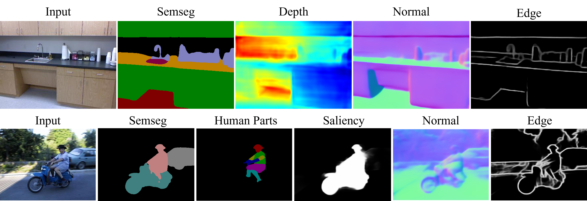
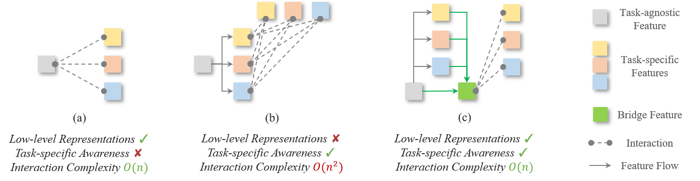

# 🌉: BridgeNet: Comprehensive and Effective Feature Interactions for Multi-task Dense Predictions

<p align="center">
  
</p>

##  :scroll: Introduction

This repository implements our TPAMI paper **BridgeNet**:
> Jingdong Zhang, Jiayuan Fan*, Peng Ye, Bo Zhang, Hancheng Ye, Baopu Li, Yancheng Cai, Tao Chen  
> *BridgeNet: Comprehensive and Effective Feature Interactions via Bridge Feature for Multi-task Dense Predictions*  
> IEEE Transactions on Pattern Analysis and Machine Intelligence (TPAMI), 2025

- **BridgeNet** is a unified framework for multi-task dense prediction that introduces **bridge features** to enable effective and efficient cross-task interactions.
- It addresses key challenges in MTL:
  1. Incomplete feature usage (low-/high-level imbalance),
  2. Entangled task semantics in task-generic features from shared backbones,
  3. Inefficient pairwise interactions with high complexity.
- BridgeNet includes:
  - **TPP**: disentangles task-specific patterns early,
  - **BFE**: constructs bridge features from multi-scale representations,
  - **TFR**: refines task outputs with linear-cost task-interaction.
- BridgeNet achieves SOTA results on **NYUD-v2**, **Cityscapes**, and **PASCAL-Context** across segmentation, depth, normals, saliency, and edges.


<p align="center">
  
  <br>
    <em>BridgeNet enables efficient multi-task interactions by leveraging both high-level and low-level features through bridge representations, combining the strengths of encoder- and decoder-focused strategies with only O(n) complexity.</em>
</p>


<p align="center">
  
  <br>
    <em>The overview of our proposed BridgeNet, which is consist of a BFE for bridge feature extraction, TPP for task pattern disentangle, and a TFR for task feature refinement.</em>
</p>


# 😎 Train your **BridgeNet**

## 1. Build recommended environment
Following [InvPT](https://github.com/prismformore/Multi-Task-Transformer/tree/main/InvPT), we implement BridgeNet on the similar environment, and here is a successful path to deploy this recommended environment:
```bash
conda create -n eemtl python=3.8
conda activate eemtl

pip install torch==1.13.1+cu117 torchvision==0.14.1+cu117 torchaudio==0.13.1 --extra-index-url https://download.pytorch.org/whl/cu117

pip install tqdm Pillow easydict pyyaml imageio scikit-image tensorboard wandb
pip install opencv-python==4.5.4.60 setuptools==59.5.0
pip install timm==0.5.4 einops==0.4.1
```
Build wheels for DCNv3 to use to powerful Deformable Convolutional Backbone [InternImage](https://github.com/OpenGVLab/InternImage) for general task feature extraction! If you wish to implement InternImage, 
you can follow their [official installation instruction](https://github.com/OpenGVLab/InternImage/tree/master/segmentation#installation), here is a brief summary:
```bash
pip install -U openmim
mim install mmsegmentation==0.30.0 mmcv==1.7.0

# Please use a version of numpy lower than 2.0
pip install numpy==1.26.4
pip install pydantic==1.10.13

cd ./models/ops_dcnv3
# Before compiling, please use the nvcc -V command to check whether your nvcc version matches the CUDA version of PyTorch.
sh ./make.sh
# unit test (should see all checking is True)
python test.py
```
If this is not working for your machine, you can also install the operator using precompiled the `.whl` files [DCNv3-1.0-whl](https://github.com/OpenGVLab/InternImage/releases/tag/whl_files).

## 2. Get data
We use the same data (PASCAL-Context and NYUD-v2) as ATRC and InvPT. You can download the data by:
```bash
wget https://data.vision.ee.ethz.ch/brdavid/atrc/NYUDv2.tar.gz
wget https://data.vision.ee.ethz.ch/brdavid/atrc/PASCALContext.tar.gz
```
And then extract the datasets by:
```bash
tar xfvz NYUDv2.tar.gz
tar xfvz PASCALContext.tar.gz
```
You need to specify the dataset directory as ```db_root``` variable in ```configs/mypath.py```. 

## 3. Train the model
The config files are defined in ```./configs```, the output directory is also defined in your config file.

As an example, you simply need to run:
```bash
bash run.sh # for training on PASCAL-Context dataset. 
```
or 
```bash
bash run_nyud.sh # for training on NYUD-v2 dataset.
```
**After specifcifing your devices and config** in ```run.sh```.
This framework supports [DDP](https://pytorch.org/tutorials/intermediate/ddp_tutorial.html) for multi-gpu training.

All models are defined in ```models/``` so it should be easy to **deploy your own model in this framework**.

## 4. Evaluate the model
The training script itself includes evaluation. 
For inferring with pre-trained models, you need to change ```run_mode``` in ```run.sh``` to ```infer```.

For boundary detection, we follow previous works and use Matlab-based [SEISM](https://github.com/jponttuset/seism) project to compute the optimal dataset F-measure scores. The evaluation code will save the boundary detection predictions on the disk. You can also use this [repo](https://github.com/prismformore/Boundary-Detection-Evaluation-Tools) produced by InvPT.

# 🤠	 Pretrained BridgeNet weights
The orginal weights are no-longer reserved 😢, we re-train our best performing models with the training code in this repository and provide the weights for the reserachers. The performance is basically equivalent 
compared with the results we reported in the paper. We also provide the training and testing tensorboard log files and 

### Download pretrained models
|Version | Dataset | Download | Segmentation | Human parsing | Saliency | Normals | Boundary Loss | 
|:-:|:-:|:-:|:-:|:-:|:-:|:-:|:-:|
| BridgeNet | PASCAL-Context | [Google Drive](https://drive.google.com/file/d/1LUDoV35W3-5OTG_3HetDc2WcQ5J1tETl/view?usp=sharing) | 80.08 | 72.36 | 85.40 | 13.25 | 0.04237 |

|Version | Dataset | Download | Segmentation | Depth | Normals | Boundary Loss |
|:-:|:-:|:-:|:-:|:-:|:-:|:-:|
| BridgeNet | NYUD-v2 | [Google Drive](https://drive.google.com/file/d/1vcjWfjIuEn9CkU-Rv7DrGhYioL7FbaN6/view?usp=sharing) | 56.75 | 0.4627 | 17.31 | 0.04706 |


### Infer with the pre-trained models
Simply set the pre-trained model path in ```run.sh``` by adding ```--trained_model pretrained_model_path```.
You also need to change ```run_mode``` in ```run.sh``` to ```infer```.


# :hugs: Cite
BibTex:
```
@article{zhang2025bridgenet,
  title={BridgeNet: Comprehensive and Effective Feature Interactions via Bridge Feature for Multi-Task Dense Predictions},
  author={Zhang, Jingdong and Fan, Jiayuan and Ye, Peng and Zhang, Bo and Ye, Hancheng and Li, Baopu and Cai, Yancheng and Chen, Tao},
  journal={IEEE Transactions on Pattern Analysis and Machine Intelligence},
  year={2025},
  publisher={IEEE}
}
```
Please also consider :star2: star our project to share with your community if you find this repository helpful!

# :blush: Contact
Please contact [Jingdong Zhang](https://evergreen0929.github.io/) if any questions.

# :+1: Acknowledgement
This repository borrows partial codes from [InvPT](https://github.com/prismformore/Multi-Task-Transformer/tree/main/InvPT), [MTI-Net](https://github.com/SimonVandenhende/Multi-Task-Learning-PyTorch) and [ATRC](https://github.com/brdav/atrc). 

# :business_suit_levitating: License
[Creative commons license](http://creativecommons.org/licenses/by-nc/4.0/) which allows for personal and research use only. 

For commercial useage, please contact the authors. 
