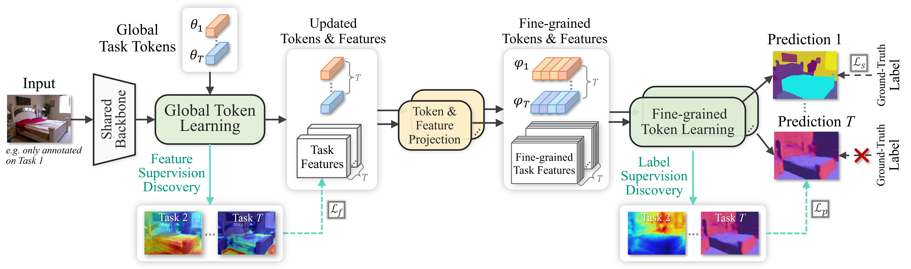

# 🏷️ Multi-Task Label Discovery via Hierarchical Task Tokens for Partially Annotated Dense Predictions

<p align="center">
  
</p>

## 📜 Introduction

This repository implements our ACMMM 2025 paper **HiTTs**:

> Jingdong Zhang, Hanrong Ye, Xin Li, Wenping Wang, Dan Xu  
> *Multi-Task Label Discovery via Hierarchical Task Tokens for Partially Annotated Dense Predictions*  
> Proceedings of the 33rd ACM International Conference on Multimedia (MM '25)

  - **HiTTs** proposes a novel approach to optimize a set of compact learnable **Hierarchical Task Tokens**, including global and fine-grained ones, to discover consistent pixel-wise supervision signals.
  - It addresses the challenge of **partially annotated dense predictions**, where each image is annotated with labels for only a subset of tasks.
  - Key contributions include:
    1.  **Global Task Tokens**: Designed for effective cross-task feature interactions in a global context and feature supervision discovery.
    2.  **Fine-grained Task Tokens**: Derived from global tokens to perform dense interactions with task-specific feature maps, enabling high-quality pseudo-label discovery.
    3.  **Hierarchical Optimization**: Jointly optimizes the multi-task network with discovered supervision signals in both feature and prediction levels.
  - Our method achieves SOTA results on **NYUD-v2**, **Cityscapes**, and **PASCAL-Context** under partially supervised settings.

<p align="center">
  
  <br>
    <em>Illustration of the proposed Hierarchical Task Tokens (HiTTs). We learn global and fine-grained task tokens to model cross-task relations and discover pseudo-labels for unlabeled tasks in both feature and prediction spaces.</em>
</p>

# 🛠️ Train your **HiTTs**

## 1\. Build recommended environment

Following [DiffusionMTL](https://github.com/prismformore/DiffusionMTL), we implement HiTTs on the similar environment, and here is a successful path to deploy this recommended environment:

```bash
conda create -n eemtl python=3.8
conda activate eemtl

pip install torch==1.13.1+cu117 torchvision==0.14.1+cu117 torchaudio==0.13.1 --extra-index-url https://download.pytorch.org/whl/cu117

pip install tqdm Pillow easydict pyyaml imageio scikit-image tensorboard wandb
pip install opencv-python==4.5.4.60 setuptools==59.5.0
pip install timm==0.5.4 einops==0.4.1
```

## 2\. Get data

We use the same data (PASCAL-Context and NYUD-v2) as ATRC and InvPT. You can download the data by:

```bash
wget https://data.vision.ee.ethz.ch/brdavid/atrc/NYUDv2.tar.gz
wget https://data.vision.ee.ethz.ch/brdavid/atrc/PASCALContext.tar.gz
```

And then extract the datasets by:

```bash
tar xfvz NYUDv2.tar.gz
tar xfvz PASCALContext.tar.gz
```

You need to specify the dataset directory as `db_root` variable in `configs/mypath.py`.

## 3\. Train the model

The config files are defined in `./configs`.

To train the model using the distillation strategy described in the paper, you need to modify the configuration in `main_distill.py` before running the scripts.

**Configuration:**
Open `main_distill.py` and modify the following parameters to point to the correct experiment config and version name:

```python
# In main_distill.py

# ... existing code ...
params['version_name'] = 'HiTTs_MS_Distill_one_pascal_final' 
args.config_exp = './configs/pascal/hitts.yml'
# ... existing code ...
```

The config files are defined in ```./configs```. You can specify the **onelabel** or **randomlabel** setting by modifying the parameter ```ssl_type``` in the config file.

**Running the training scripts:**
After configuring the files, you can run the shell scripts provided.

For **PASCAL-Context**:

```bash
bash run_hitts.sh
```

For **NYUD-v2**:

```bash
bash run_hitts_nyud.sh
```

This framework supports [DDP](https://pytorch.org/tutorials/intermediate/ddp_tutorial.html) for multi-gpu training. All models are defined in `models/` so it should be easy to **deploy your own model in this framework**.


# 📦 Pretrained weights

We provide the pretrained weights for our best performing models.

|Version | Dataset | Download | Segmentation | Human parsing | Saliency | Normals | Boundary Loss | 
|:-:|:-:|:-:|:-:|:-:|:-:|:-:|:-:|
| One-Label | PASCAL-Context | [Google Drive] | - | - | - | - | - |
| Random-Labels | PASCAL-Context | [Google Drive] | - | - | - | - | - |

|Version | Dataset | Download | Segmentation | Depth | Normals |
|:-:|:-:|:-:|:-:|:-:|:-:|
| One-Label | NYUD-v2 | [Google Drive] | - | - | - |
| Random-Labels | NYUD-v2 | [Google Drive] | - | - | - |


# 🤗 Cite

BibTex:

```bibtex
@inproceedings{zhang2025multi,
  title={Multi-task label discovery via hierarchical task tokens for partially annotated dense predictions},
  author={Zhang, Jingdong and Ye, Hanrong and Li, Xin and Wang, Wenping and Xu, Dan},
  booktitle={Proceedings of the 33rd ACM International Conference on Multimedia},
  pages={719--728},
  year={2025}
}
```

Please also consider 🌟 star our project to share with your community if you find this repository helpful\!

# 😊 Contact

Please contact [Jingdong Zhang](mailto:jdzhang@tamu.edu) if any questions.

# 👍 Acknowledgement

This repository borrows partial codes from [InvPT](https://github.com/prismformore/Multi-Task-Transformer/tree/main/InvPT) and [DiffusionMTL](https://github.com/prismformore/DiffusionMTL).

# 🕴️ License

[Creative commons license](http://creativecommons.org/licenses/by-nc/4.0/) which allows for personal and research use only.

For commercial usage, please contact the authors.